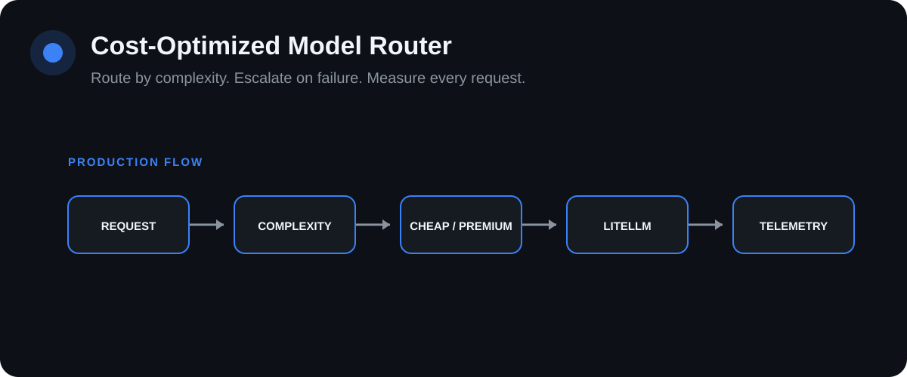

# Cost-Optimized Model Router

[](https://github.com/Lonfea/cost-optimized-model-router/actions/workflows/ci.yml)


<p align="center"></p>

A production-oriented LLM gateway that routes each request to an appropriate model tier based on complexity, records estimated spend per request, exposes operational metrics, and falls back to the premium tier when the cheap path fails.

## Product UI

A product-style interface is included at `app/static/index.html`. Run the FastAPI service and open `http://localhost:8000/` to use the interface against the real backend endpoints.

## The production problem

Using the strongest model for every request wastes money. Using the cheapest model for every request creates quality failures. A production gateway needs a policy that makes the trade-off **explicit, observable and testable**.

```text
flowchart LR
U[Client] --> API[FastAPI Gateway]
API --> C[Complexity Classifier]
C -->|simple| CH[Cheap Tier]
C -->|complex| PR[Premium Tier]
CH --> L[LiteLLM]
PR --> L
CH -. failure .-> PR
L --> R[Response]
L --> M[Prometheus Metrics]
M --> COST[Spend / request]
M --> LAT[Latency]
M --> ERR[Failures] 
```

## Routing decision

```text
flowchart TD
Q[Incoming prompt] --> S{Complexity score}
S -->|below threshold| C[Cheap model]
S -->|at/above threshold| P[Premium model]
C --> F{Provider call succeeds?}
F -->|yes| O[Return + telemetry]
F -->|no| P
P --> O 
```

## What this demonstrates

- custom routing policy rather than hard-coding one model;
- explicit cost-versus-quality engineering;
- provider-agnostic calls through LiteLLM;
- per-request routing reasons and cost estimates;
- Prometheus spend, latency, request and failure metrics;
- deterministic tests for routing decisions;
- fallback behavior when the low-cost path fails.

## Complexity signals

The current transparent heuristic scores prompt length, errors/stack traces, architecture and security language, multi-step reasoning markers, production/regression sensitivity and an optional caller override.

A future learned router can be evaluated against this interpretable baseline.

## Configuration

| Variable | Purpose |
|---|---|
| `CHEAP_MODEL` | low-cost/default tier |
| `PREMIUM_MODEL` | stronger escalation tier |
| `COMPLEXITY_THRESHOLD` | routing boundary |

Model IDs remain configuration rather than routing-code constants.

## Run locally

```bash
git clone https://github.com/Lonfea/cost-optimized-model-router.git
cd cost-optimized-model-router
python -m venv .venv
source .venv/bin/activate
pip install -e ".[dev]"
cp .env.example .env
uvicorn app.main:app --reload
```

## API surface

**POST `/chat`** returns the response plus selected tier/model, complexity score, routing reasons, latency, cost estimate and fallback status.

**GET `/metrics`** exposes Prometheus-compatible telemetry.

## Engineering roadmap

- learned routing classifier and labelled routing benchmark;
- per-tenant model budgets;
- semantic caching;
- provider health scoring;
- cost/quality Pareto analysis;
- Grafana dashboard and SLO alerts.

> This repository does not claim a cost-saving percentage until the router is benchmarked against real traffic.
